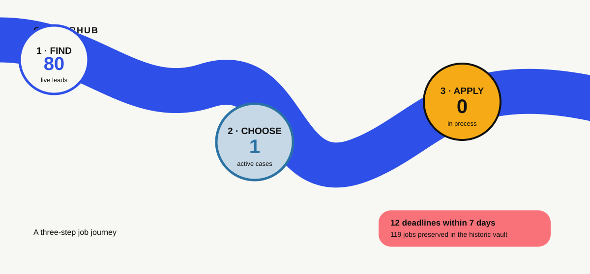

# CareerHub

## 1 · FIND JOBS → 2 · CHOOSE JOB → 3 · APPLY

Everything else—sourcing, ranking, HRDM, research, documents, reminders and follow-up—sits inside these three steps.

---

## 1 · Find jobs

**Last sourcing refresh:** 2026-09-25 10:14 UTC · **80 live leads** · **86 jobs in the historic vault**

**After pressing Refresh:** new results normally appear here in about **30–90 seconds**. The page changes only when the sourcing workflow has finished and committed the new shortlist.

**[Refresh jobs now →](https://github.com/Hybrismannen/wpb/actions/workflows/careerhub-scan.yml)** · **[Open historic Job Vault →](JOB_VAULT.md)** · **[Analyse a job I found elsewhere →](https://github.com/Hybrismannen/wpb/issues/new?template=careerhub-analyse-job.yml)**

### Career-track

Writing, reporting, editorial, communications, research and culture/NGO.

| Priority | Role | Employer | Deadline | Why | Analyse? |
|---|---|---|---|---|---|
| Top lead | [Global PR & Communications Manager to H&M HOME](https://arbetsformedlingen.se/platsbanken/annonser/31417247) | H & M Hennes & Mauritz GBC AB | 30 Sep · 5 days | Arbete på plats · matches communications NGO | Analysed · [open case #5](https://github.com/Hybrismannen/wpb/issues/5) |
| Top lead | [Corporate Communications & Public Affairs](https://arbetsformedlingen.se/platsbanken/annonser/31491509) | Lovable Labs Sweden AB | 17 Feb · 145 days | Arbete på plats · matches communications NGO | **Do you want to analyse this job? [YES →](https://github.com/Hybrismannen/wpb/issues/new?title=%5BCareerHub%20Job%5D%20Lovable%20Labs%20Sweden%20AB%20%E2%80%94%20Corporate%20Communications%20%26%20Public%20Affairs&body=%23%23%20CareerHub%20%E2%80%94%20Analyse%20this%20job%0A%0AEverything%20is%20already%20filled%20in.%20To%20start%20the%20HRDM%20analysis%2C%20click%20the%20green%20%2A%2ACreate%20issue%2A%2A%20/%20%2A%2ASubmit%20new%20issue%2A%2A%20button%20at%20the%20bottom%20of%20the%20page.%0A%0A%23%23%23%20Job%20URL%0Ahttps%3A//arbetsformedlingen.se/platsbanken/annonser/31491509%0A%0A%23%23%23%20Job%20ID%0Af692b21c9192771f%0A%0A%23%23%23%20Role%0ACorporate%20Communications%20%26%20Public%20Affairs%0A%0A%23%23%23%20Employer%0ALovable%20Labs%20Sweden%20AB%0A%0A%23%23%23%20Lane%0Acore%0A%0A%23%23%23%20Priority%201%E2%80%935%0A5%0A%0A%23%23%23%20Deadline%0A2027-02-17T23%3A59%3A59%0A%0A%23%23%23%20Job%20text%20%28optional%29%0A_Leave%20blank%20unless%20the%20site%20blocks%20automated%20retrieval._)** |
| Top lead | [Junior kommunikatör med fokus på innehåll och produktion](https://arbetsformedlingen.se/platsbanken/annonser/31515529) | SKOLIDROTTSFÖRBUNDET I SKÅNE | 19 Oct · 24 days | matches pressekreterare | **Do you want to analyse this job? [YES →](https://github.com/Hybrismannen/wpb/issues/new?title=%5BCareerHub%20Job%5D%20SKOLIDROTTSF%C3%96RBUNDET%20I%20SK%C3%85NE%20%E2%80%94%20Junior%20kommunikat%C3%B6r%20med%20fokus%20p%C3%A5%20inneh%C3%A5ll%20och%20produktion&body=%23%23%20CareerHub%20%E2%80%94%20Analyse%20this%20job%0A%0AEverything%20is%20already%20filled%20in.%20To%20start%20the%20HRDM%20analysis%2C%20click%20the%20green%20%2A%2ACreate%20issue%2A%2A%20/%20%2A%2ASubmit%20new%20issue%2A%2A%20button%20at%20the%20bottom%20of%20the%20page.%0A%0A%23%23%23%20Job%20URL%0Ahttps%3A//arbetsformedlingen.se/platsbanken/annonser/31515529%0A%0A%23%23%23%20Job%20ID%0A172c039dec624895%0A%0A%23%23%23%20Role%0AJunior%20kommunikat%C3%B6r%20med%20fokus%20p%C3%A5%20inneh%C3%A5ll%20och%20produktion%0A%0A%23%23%23%20Employer%0ASKOLIDROTTSF%C3%96RBUNDET%20I%20SK%C3%85NE%0A%0A%23%23%23%20Lane%0Acore%0A%0A%23%23%23%20Priority%201%E2%80%935%0A4%0A%0A%23%23%23%20Deadline%0A2026-10-19T23%3A59%3A59%0A%0A%23%23%23%20Job%20text%20%28optional%29%0A_Leave%20blank%20unless%20the%20site%20blocks%20automated%20retrieval._)** |
| Top lead | [Vikarierande kommunikatör](https://arbetsformedlingen.se/platsbanken/annonser/31507714) | Inspektionen För Vård och Omsorg | 08 Oct · 13 days | matches kommunikatör | **Do you want to analyse this job? [YES →](https://github.com/Hybrismannen/wpb/issues/new?title=%5BCareerHub%20Job%5D%20Inspektionen%20F%C3%B6r%20V%C3%A5rd%20och%20Omsorg%20%E2%80%94%20Vikarierande%20kommunikat%C3%B6r&body=%23%23%20CareerHub%20%E2%80%94%20Analyse%20this%20job%0A%0AEverything%20is%20already%20filled%20in.%20To%20start%20the%20HRDM%20analysis%2C%20click%20the%20green%20%2A%2ACreate%20issue%2A%2A%20/%20%2A%2ASubmit%20new%20issue%2A%2A%20button%20at%20the%20bottom%20of%20the%20page.%0A%0A%23%23%23%20Job%20URL%0Ahttps%3A//arbetsformedlingen.se/platsbanken/annonser/31507714%0A%0A%23%23%23%20Job%20ID%0A906666be4b086262%0A%0A%23%23%23%20Role%0AVikarierande%20kommunikat%C3%B6r%0A%0A%23%23%23%20Employer%0AInspektionen%20F%C3%B6r%20V%C3%A5rd%20och%20Omsorg%0A%0A%23%23%23%20Lane%0Acore%0A%0A%23%23%23%20Priority%201%E2%80%935%0A4%0A%0A%23%23%23%20Deadline%0A2026-10-08T23%3A59%3A59%0A%0A%23%23%23%20Job%20text%20%28optional%29%0A_Leave%20blank%20unless%20the%20site%20blocks%20automated%20retrieval._)** |
| Good option | [Content Producer](https://arbetsformedlingen.se/platsbanken/annonser/31397411) | Blenda Labs AB | **25 Sep · today** | Arbete på plats · matches content writer | **Do you want to analyse this job? [YES →](https://github.com/Hybrismannen/wpb/issues/new?title=%5BCareerHub%20Job%5D%20Blenda%20Labs%20AB%20%E2%80%94%20Content%20Producer&body=%23%23%20CareerHub%20%E2%80%94%20Analyse%20this%20job%0A%0AEverything%20is%20already%20filled%20in.%20To%20start%20the%20HRDM%20analysis%2C%20click%20the%20green%20%2A%2ACreate%20issue%2A%2A%20/%20%2A%2ASubmit%20new%20issue%2A%2A%20button%20at%20the%20bottom%20of%20the%20page.%0A%0A%23%23%23%20Job%20URL%0Ahttps%3A//arbetsformedlingen.se/platsbanken/annonser/31397411%0A%0A%23%23%23%20Job%20ID%0A39597e0e2b5b69bb%0A%0A%23%23%23%20Role%0AContent%20Producer%0A%0A%23%23%23%20Employer%0ABlenda%20Labs%20AB%0A%0A%23%23%23%20Lane%0Acore%0A%0A%23%23%23%20Priority%201%E2%80%935%0A4%0A%0A%23%23%23%20Deadline%0A2026-09-25T23%3A59%3A59%0A%0A%23%23%23%20Job%20text%20%28optional%29%0A_Leave%20blank%20unless%20the%20site%20blocks%20automated%20retrieval._)** |
| Good option | [PR & Communications Manager - Stockholm](https://arbetsformedlingen.se/platsbanken/annonser/31470270) | Nordic Investin Group Aktiebolag | 12 Mar · 168 days | Arbete på plats · matches communications NGO | **Do you want to analyse this job? [YES →](https://github.com/Hybrismannen/wpb/issues/new?title=%5BCareerHub%20Job%5D%20Nordic%20Investin%20Group%20Aktiebolag%20%E2%80%94%20PR%20%26%20Communications%20Manager%20-%20Stockholm&body=%23%23%20CareerHub%20%E2%80%94%20Analyse%20this%20job%0A%0AEverything%20is%20already%20filled%20in.%20To%20start%20the%20HRDM%20analysis%2C%20click%20the%20green%20%2A%2ACreate%20issue%2A%2A%20/%20%2A%2ASubmit%20new%20issue%2A%2A%20button%20at%20the%20bottom%20of%20the%20page.%0A%0A%23%23%23%20Job%20URL%0Ahttps%3A//arbetsformedlingen.se/platsbanken/annonser/31470270%0A%0A%23%23%23%20Job%20ID%0A9b5ab970ad3cf007%0A%0A%23%23%23%20Role%0APR%20%26%20Communications%20Manager%20-%20Stockholm%0A%0A%23%23%23%20Employer%0ANordic%20Investin%20Group%20Aktiebolag%0A%0A%23%23%23%20Lane%0Acore%0A%0A%23%23%23%20Priority%201%E2%80%935%0A3%0A%0A%23%23%23%20Deadline%0A2027-03-12T23%3A59%3A59%0A%0A%23%23%23%20Job%20text%20%28optional%29%0A_Leave%20blank%20unless%20the%20site%20blocks%20automated%20retrieval._)** |
| Good option | [Grävande journalist (extrajobb)](https://arbetsformedlingen.se/platsbanken/annonser/31428095) | Cigarrklubben CK Sverige AB | 31 Dec · 97 days | Arbete på plats · matches reporter | **Do you want to analyse this job? [YES →](https://github.com/Hybrismannen/wpb/issues/new?title=%5BCareerHub%20Job%5D%20Cigarrklubben%20CK%20Sverige%20AB%20%E2%80%94%20Gr%C3%A4vande%20journalist%20%28extrajobb%29&body=%23%23%20CareerHub%20%E2%80%94%20Analyse%20this%20job%0A%0AEverything%20is%20already%20filled%20in.%20To%20start%20the%20HRDM%20analysis%2C%20click%20the%20green%20%2A%2ACreate%20issue%2A%2A%20/%20%2A%2ASubmit%20new%20issue%2A%2A%20button%20at%20the%20bottom%20of%20the%20page.%0A%0A%23%23%23%20Job%20URL%0Ahttps%3A//arbetsformedlingen.se/platsbanken/annonser/31428095%0A%0A%23%23%23%20Job%20ID%0Aba92e1ee2883eb47%0A%0A%23%23%23%20Role%0AGr%C3%A4vande%20journalist%20%28extrajobb%29%0A%0A%23%23%23%20Employer%0ACigarrklubben%20CK%20Sverige%20AB%0A%0A%23%23%23%20Lane%0Acore%0A%0A%23%23%23%20Priority%201%E2%80%935%0A3%0A%0A%23%23%23%20Deadline%0A2026-12-31T23%3A59%3A59%0A%0A%23%23%23%20Job%20text%20%28optional%29%0A_Leave%20blank%20unless%20the%20site%20blocks%20automated%20retrieval._)** |
| Good option | [Erfaren kommunikatör](https://arbetsformedlingen.se/platsbanken/annonser/31507756) | Inspektionen För Vård och Omsorg | 08 Oct · 13 days | matches kommunikatör | **Do you want to analyse this job? [YES →](https://github.com/Hybrismannen/wpb/issues/new?title=%5BCareerHub%20Job%5D%20Inspektionen%20F%C3%B6r%20V%C3%A5rd%20och%20Omsorg%20%E2%80%94%20Erfaren%20kommunikat%C3%B6r&body=%23%23%20CareerHub%20%E2%80%94%20Analyse%20this%20job%0A%0AEverything%20is%20already%20filled%20in.%20To%20start%20the%20HRDM%20analysis%2C%20click%20the%20green%20%2A%2ACreate%20issue%2A%2A%20/%20%2A%2ASubmit%20new%20issue%2A%2A%20button%20at%20the%20bottom%20of%20the%20page.%0A%0A%23%23%23%20Job%20URL%0Ahttps%3A//arbetsformedlingen.se/platsbanken/annonser/31507756%0A%0A%23%23%23%20Job%20ID%0A41d79eb9c71d67e2%0A%0A%23%23%23%20Role%0AErfaren%20kommunikat%C3%B6r%0A%0A%23%23%23%20Employer%0AInspektionen%20F%C3%B6r%20V%C3%A5rd%20och%20Omsorg%0A%0A%23%23%23%20Lane%0Acore%0A%0A%23%23%23%20Priority%201%E2%80%935%0A3%0A%0A%23%23%23%20Deadline%0A2026-10-08T23%3A59%3A59%0A%0A%23%23%23%20Job%20text%20%28optional%29%0A_Leave%20blank%20unless%20the%20site%20blocks%20automated%20retrieval._)** |

_Showing the top 8 of 45 current leads in this group._

### Adjacent

Transferable content, coordination, research-support and communications work.

| Priority | Role | Employer | Deadline | Why | Analyse? |
|---|---|---|---|---|---|
| Top lead | [Research Coordinator](https://arbetsformedlingen.se/platsbanken/annonser/31496388) | Sveriges Lantbruksuniversitet | 09 Oct · 14 days | Arbete på plats · matches communications coordinator | **Do you want to analyse this job? [YES →](https://github.com/Hybrismannen/wpb/issues/new?title=%5BCareerHub%20Job%5D%20Sveriges%20Lantbruksuniversitet%20%E2%80%94%20Research%20Coordinator&body=%23%23%20CareerHub%20%E2%80%94%20Analyse%20this%20job%0A%0AEverything%20is%20already%20filled%20in.%20To%20start%20the%20HRDM%20analysis%2C%20click%20the%20green%20%2A%2ACreate%20issue%2A%2A%20/%20%2A%2ASubmit%20new%20issue%2A%2A%20button%20at%20the%20bottom%20of%20the%20page.%0A%0A%23%23%23%20Job%20URL%0Ahttps%3A//arbetsformedlingen.se/platsbanken/annonser/31496388%0A%0A%23%23%23%20Job%20ID%0Adfcbcef0211c87fe%0A%0A%23%23%23%20Role%0AResearch%20Coordinator%0A%0A%23%23%23%20Employer%0ASveriges%20Lantbruksuniversitet%0A%0A%23%23%23%20Lane%0Aadjacent%0A%0A%23%23%23%20Priority%201%E2%80%935%0A5%0A%0A%23%23%23%20Deadline%0A2026-10-09T23%3A59%3A59%0A%0A%23%23%23%20Job%20text%20%28optional%29%0A_Leave%20blank%20unless%20the%20site%20blocks%20automated%20retrieval._)** |
| Top lead | [Project Coordinator – International EU Research Infrastructure Projects](https://arbetsformedlingen.se/platsbanken/annonser/31518421) | Academic Work Sweden AB | 24 Mar · 180 days | matches research coordinator | **Do you want to analyse this job? [YES →](https://github.com/Hybrismannen/wpb/issues/new?title=%5BCareerHub%20Job%5D%20Academic%20Work%20Sweden%20AB%20%E2%80%94%20Project%20Coordinator%20%E2%80%93%20International%20EU%20Research%20Infrastructure%20Projects&body=%23%23%20CareerHub%20%E2%80%94%20Analyse%20this%20job%0A%0AEverything%20is%20already%20filled%20in.%20To%20start%20the%20HRDM%20analysis%2C%20click%20the%20green%20%2A%2ACreate%20issue%2A%2A%20/%20%2A%2ASubmit%20new%20issue%2A%2A%20button%20at%20the%20bottom%20of%20the%20page.%0A%0A%23%23%23%20Job%20URL%0Ahttps%3A//arbetsformedlingen.se/platsbanken/annonser/31518421%0A%0A%23%23%23%20Job%20ID%0A1cc0eab55f1c5200%0A%0A%23%23%23%20Role%0AProject%20Coordinator%20%E2%80%93%20International%20EU%20Research%20Infrastructure%20Projects%0A%0A%23%23%23%20Employer%0AAcademic%20Work%20Sweden%20AB%0A%0A%23%23%23%20Lane%0Aadjacent%0A%0A%23%23%23%20Priority%201%E2%80%935%0A5%0A%0A%23%23%23%20Deadline%0A2027-03-24T23%3A59%3A59%0A%0A%23%23%23%20Job%20text%20%28optional%29%0A_Leave%20blank%20unless%20the%20site%20blocks%20automated%20retrieval._)** |
| Top lead | [Sälj- och projektkoordinator Speeron Stockholm](https://arbetsformedlingen.se/platsbanken/annonser/31490511) | Closers AB | 18 Oct · 23 days | Arbete på plats · matches projektkoordinator | **Do you want to analyse this job? [YES →](https://github.com/Hybrismannen/wpb/issues/new?title=%5BCareerHub%20Job%5D%20Closers%20AB%20%E2%80%94%20S%C3%A4lj-%20och%20projektkoordinator%20Speeron%20Stockholm&body=%23%23%20CareerHub%20%E2%80%94%20Analyse%20this%20job%0A%0AEverything%20is%20already%20filled%20in.%20To%20start%20the%20HRDM%20analysis%2C%20click%20the%20green%20%2A%2ACreate%20issue%2A%2A%20/%20%2A%2ASubmit%20new%20issue%2A%2A%20button%20at%20the%20bottom%20of%20the%20page.%0A%0A%23%23%23%20Job%20URL%0Ahttps%3A//arbetsformedlingen.se/platsbanken/annonser/31490511%0A%0A%23%23%23%20Job%20ID%0A3667109f6db2f4e3%0A%0A%23%23%23%20Role%0AS%C3%A4lj-%20och%20projektkoordinator%20Speeron%20Stockholm%0A%0A%23%23%23%20Employer%0AClosers%20AB%0A%0A%23%23%23%20Lane%0Aadjacent%0A%0A%23%23%23%20Priority%201%E2%80%935%0A4%0A%0A%23%23%23%20Deadline%0A2026-10-18T23%3A59%3A59%0A%0A%23%23%23%20Job%20text%20%28optional%29%0A_Leave%20blank%20unless%20the%20site%20blocks%20automated%20retrieval._)** |
| Top lead | [REF-061 \| Senior projektkoordinator och förändringsledare](https://arbetsformedlingen.se/platsbanken/annonser/31484839) | Lynqa AB | 15 Mar · 171 days | Arbete på plats · matches projektkoordinator | **Do you want to analyse this job? [YES →](https://github.com/Hybrismannen/wpb/issues/new?title=%5BCareerHub%20Job%5D%20Lynqa%20AB%20%E2%80%94%20REF-061%20%7C%20Senior%20projektkoordinator%20och%20f%C3%B6r%C3%A4ndringsledare&body=%23%23%20CareerHub%20%E2%80%94%20Analyse%20this%20job%0A%0AEverything%20is%20already%20filled%20in.%20To%20start%20the%20HRDM%20analysis%2C%20click%20the%20green%20%2A%2ACreate%20issue%2A%2A%20/%20%2A%2ASubmit%20new%20issue%2A%2A%20button%20at%20the%20bottom%20of%20the%20page.%0A%0A%23%23%23%20Job%20URL%0Ahttps%3A//arbetsformedlingen.se/platsbanken/annonser/31484839%0A%0A%23%23%23%20Job%20ID%0A45b7ffeb581f2a0f%0A%0A%23%23%23%20Role%0AREF-061%20%7C%20Senior%20projektkoordinator%20och%20f%C3%B6r%C3%A4ndringsledare%0A%0A%23%23%23%20Employer%0ALynqa%20AB%0A%0A%23%23%23%20Lane%0Aadjacent%0A%0A%23%23%23%20Priority%201%E2%80%935%0A4%0A%0A%23%23%23%20Deadline%0A2027-03-15T23%3A59%3A59%0A%0A%23%23%23%20Job%20text%20%28optional%29%0A_Leave%20blank%20unless%20the%20site%20blocks%20automated%20retrieval._)** |
| Good option | [Projektledare och projektkoordinator i Umeå](https://arbetsformedlingen.se/platsbanken/annonser/31449188) | Academic Work Sweden AB | 07 Mar · 163 days | Arbete på plats · matches projektkoordinator | **Do you want to analyse this job? [YES →](https://github.com/Hybrismannen/wpb/issues/new?title=%5BCareerHub%20Job%5D%20Academic%20Work%20Sweden%20AB%20%E2%80%94%20Projektledare%20och%20projektkoordinator%20i%20Ume%C3%A5&body=%23%23%20CareerHub%20%E2%80%94%20Analyse%20this%20job%0A%0AEverything%20is%20already%20filled%20in.%20To%20start%20the%20HRDM%20analysis%2C%20click%20the%20green%20%2A%2ACreate%20issue%2A%2A%20/%20%2A%2ASubmit%20new%20issue%2A%2A%20button%20at%20the%20bottom%20of%20the%20page.%0A%0A%23%23%23%20Job%20URL%0Ahttps%3A//arbetsformedlingen.se/platsbanken/annonser/31449188%0A%0A%23%23%23%20Job%20ID%0A2b2b37ad020ce347%0A%0A%23%23%23%20Role%0AProjektledare%20och%20projektkoordinator%20i%20Ume%C3%A5%0A%0A%23%23%23%20Employer%0AAcademic%20Work%20Sweden%20AB%0A%0A%23%23%23%20Lane%0Aadjacent%0A%0A%23%23%23%20Priority%201%E2%80%935%0A4%0A%0A%23%23%23%20Deadline%0A2027-03-07T23%3A59%3A59%0A%0A%23%23%23%20Job%20text%20%28optional%29%0A_Leave%20blank%20unless%20the%20site%20blocks%20automated%20retrieval._)** |
| Good option | [Teknisk projektkoordinator till vår kund i Finspång](https://arbetsformedlingen.se/platsbanken/annonser/31447155) | Poolia AB | **27 Sep · 2 days** | Arbete på plats · matches projektkoordinator | **Do you want to analyse this job? [YES →](https://github.com/Hybrismannen/wpb/issues/new?title=%5BCareerHub%20Job%5D%20Poolia%20AB%20%E2%80%94%20Teknisk%20projektkoordinator%20till%20v%C3%A5r%20kund%20i%20Finsp%C3%A5ng&body=%23%23%20CareerHub%20%E2%80%94%20Analyse%20this%20job%0A%0AEverything%20is%20already%20filled%20in.%20To%20start%20the%20HRDM%20analysis%2C%20click%20the%20green%20%2A%2ACreate%20issue%2A%2A%20/%20%2A%2ASubmit%20new%20issue%2A%2A%20button%20at%20the%20bottom%20of%20the%20page.%0A%0A%23%23%23%20Job%20URL%0Ahttps%3A//arbetsformedlingen.se/platsbanken/annonser/31447155%0A%0A%23%23%23%20Job%20ID%0Ac48f6e6bdd91c451%0A%0A%23%23%23%20Role%0ATeknisk%20projektkoordinator%20till%20v%C3%A5r%20kund%20i%20Finsp%C3%A5ng%0A%0A%23%23%23%20Employer%0APoolia%20AB%0A%0A%23%23%23%20Lane%0Aadjacent%0A%0A%23%23%23%20Priority%201%E2%80%935%0A3%0A%0A%23%23%23%20Deadline%0A2026-09-27T23%3A59%3A59%0A%0A%23%23%23%20Job%20text%20%28optional%29%0A_Leave%20blank%20unless%20the%20site%20blocks%20automated%20retrieval._)** |
| Good option | [Marketing Specialist – Paid Social & Content](https://arbetsformedlingen.se/platsbanken/annonser/31444510) | Keystone Education Group AB | 06 Mar · 162 days | Arbete på plats · matches content specialist | **Do you want to analyse this job? [YES →](https://github.com/Hybrismannen/wpb/issues/new?title=%5BCareerHub%20Job%5D%20Keystone%20Education%20Group%20AB%20%E2%80%94%20Marketing%20Specialist%20%E2%80%93%20Paid%20Social%20%26%20Content&body=%23%23%20CareerHub%20%E2%80%94%20Analyse%20this%20job%0A%0AEverything%20is%20already%20filled%20in.%20To%20start%20the%20HRDM%20analysis%2C%20click%20the%20green%20%2A%2ACreate%20issue%2A%2A%20/%20%2A%2ASubmit%20new%20issue%2A%2A%20button%20at%20the%20bottom%20of%20the%20page.%0A%0A%23%23%23%20Job%20URL%0Ahttps%3A//arbetsformedlingen.se/platsbanken/annonser/31444510%0A%0A%23%23%23%20Job%20ID%0Ae408d1bcdcb909f0%0A%0A%23%23%23%20Role%0AMarketing%20Specialist%20%E2%80%93%20Paid%20Social%20%26%20Content%0A%0A%23%23%23%20Employer%0AKeystone%20Education%20Group%20AB%0A%0A%23%23%23%20Lane%0Aadjacent%0A%0A%23%23%23%20Priority%201%E2%80%935%0A3%0A%0A%23%23%23%20Deadline%0A2027-03-06T23%3A59%3A59%0A%0A%23%23%23%20Job%20text%20%28optional%29%0A_Leave%20blank%20unless%20the%20site%20blocks%20automated%20retrieval._)** |
| Good option | [Handelskammaren Mittsverige söker projektkoordinator till Örnsköldsvik](https://arbetsformedlingen.se/platsbanken/annonser/31507069) | Handelskammaren Mittsveriges Service AB | 22 Oct · 27 days | matches projektkoordinator | **Do you want to analyse this job? [YES →](https://github.com/Hybrismannen/wpb/issues/new?title=%5BCareerHub%20Job%5D%20Handelskammaren%20Mittsveriges%20Service%20AB%20%E2%80%94%20Handelskammaren%20Mittsverige%20s%C3%B6ker%20projektkoordinator%20till%20%C3%96rnsk%C3%B6ldsvik&body=%23%23%20CareerHub%20%E2%80%94%20Analyse%20this%20job%0A%0AEverything%20is%20already%20filled%20in.%20To%20start%20the%20HRDM%20analysis%2C%20click%20the%20green%20%2A%2ACreate%20issue%2A%2A%20/%20%2A%2ASubmit%20new%20issue%2A%2A%20button%20at%20the%20bottom%20of%20the%20page.%0A%0A%23%23%23%20Job%20URL%0Ahttps%3A//arbetsformedlingen.se/platsbanken/annonser/31507069%0A%0A%23%23%23%20Job%20ID%0A32aa1a9250614950%0A%0A%23%23%23%20Role%0AHandelskammaren%20Mittsverige%20s%C3%B6ker%20projektkoordinator%20till%20%C3%96rnsk%C3%B6ldsvik%0A%0A%23%23%23%20Employer%0AHandelskammaren%20Mittsveriges%20Service%20AB%0A%0A%23%23%23%20Lane%0Aadjacent%0A%0A%23%23%23%20Priority%201%E2%80%935%0A3%0A%0A%23%23%23%20Deadline%0A2026-10-22T23%3A59%3A59%0A%0A%23%23%23%20Job%20text%20%28optional%29%0A_Leave%20blank%20unless%20the%20site%20blocks%20automated%20retrieval._)** |

_Showing the top 8 of 16 current leads in this group._

### Extra-income / flexible

Part-time, temporary and lower-barrier work.

| Priority | Role | Employer | Deadline | Why | Analyse? |
|---|---|---|---|---|---|
| Top lead | [Customer Support Specialist](https://remoteOK.com/remote-jobs/remote-customer-support-specialist-resource-guru-1136066) | Resource Guru | No deadline shown | remote · part-time | **Do you want to analyse this job? [YES →](https://github.com/Hybrismannen/wpb/issues/new?title=%5BCareerHub%20Job%5D%20Resource%20Guru%20%E2%80%94%20Customer%20Support%20Specialist&body=%23%23%20CareerHub%20%E2%80%94%20Analyse%20this%20job%0A%0AEverything%20is%20already%20filled%20in.%20To%20start%20the%20HRDM%20analysis%2C%20click%20the%20green%20%2A%2ACreate%20issue%2A%2A%20/%20%2A%2ASubmit%20new%20issue%2A%2A%20button%20at%20the%20bottom%20of%20the%20page.%0A%0A%23%23%23%20Job%20URL%0Ahttps%3A//remoteOK.com/remote-jobs/remote-customer-support-specialist-resource-guru-1136066%0A%0A%23%23%23%20Job%20ID%0A066efc7f9f1f5193%0A%0A%23%23%23%20Role%0ACustomer%20Support%20Specialist%0A%0A%23%23%23%20Employer%0AResource%20Guru%0A%0A%23%23%23%20Lane%0Abridge%0A%0A%23%23%23%20Priority%201%E2%80%935%0A5%0A%0A%23%23%23%20Deadline%0A%0A%0A%23%23%23%20Job%20text%20%28optional%29%0A_Leave%20blank%20unless%20the%20site%20blocks%20automated%20retrieval._)** |
| Top lead | [Vi söker en receptionist på deltid för ett vikariat!](https://arbetsformedlingen.se/platsbanken/annonser/31480261) | Uniflex AB | 14 Mar · 170 days | Arbete på plats · part-time | **Do you want to analyse this job? [YES →](https://github.com/Hybrismannen/wpb/issues/new?title=%5BCareerHub%20Job%5D%20Uniflex%20AB%20%E2%80%94%20Vi%20s%C3%B6ker%20en%20receptionist%20p%C3%A5%20deltid%20f%C3%B6r%20ett%20vikariat%21&body=%23%23%20CareerHub%20%E2%80%94%20Analyse%20this%20job%0A%0AEverything%20is%20already%20filled%20in.%20To%20start%20the%20HRDM%20analysis%2C%20click%20the%20green%20%2A%2ACreate%20issue%2A%2A%20/%20%2A%2ASubmit%20new%20issue%2A%2A%20button%20at%20the%20bottom%20of%20the%20page.%0A%0A%23%23%23%20Job%20URL%0Ahttps%3A//arbetsformedlingen.se/platsbanken/annonser/31480261%0A%0A%23%23%23%20Job%20ID%0Aaadc3ba45d849b5c%0A%0A%23%23%23%20Role%0AVi%20s%C3%B6ker%20en%20receptionist%20p%C3%A5%20deltid%20f%C3%B6r%20ett%20vikariat%21%0A%0A%23%23%23%20Employer%0AUniflex%20AB%0A%0A%23%23%23%20Lane%0Abridge%0A%0A%23%23%23%20Priority%201%E2%80%935%0A5%0A%0A%23%23%23%20Deadline%0A2027-03-14T23%3A59%3A59%0A%0A%23%23%23%20Job%20text%20%28optional%29%0A_Leave%20blank%20unless%20the%20site%20blocks%20automated%20retrieval._)** |
| Top lead | [Timavlönad servicevärd till Växjö sjukhus ](https://arbetsformedlingen.se/platsbanken/annonser/31498167) | REGION KRONOBERG | 05 Oct · 10 days | Arbete på plats · matches servicevärd | **Do you want to analyse this job? [YES →](https://github.com/Hybrismannen/wpb/issues/new?title=%5BCareerHub%20Job%5D%20REGION%20KRONOBERG%20%E2%80%94%20Timavl%C3%B6nad%20servicev%C3%A4rd%20till%20V%C3%A4xj%C3%B6%20sjukhus%20&body=%23%23%20CareerHub%20%E2%80%94%20Analyse%20this%20job%0A%0AEverything%20is%20already%20filled%20in.%20To%20start%20the%20HRDM%20analysis%2C%20click%20the%20green%20%2A%2ACreate%20issue%2A%2A%20/%20%2A%2ASubmit%20new%20issue%2A%2A%20button%20at%20the%20bottom%20of%20the%20page.%0A%0A%23%23%23%20Job%20URL%0Ahttps%3A//arbetsformedlingen.se/platsbanken/annonser/31498167%0A%0A%23%23%23%20Job%20ID%0Ac805cc42e3f20447%0A%0A%23%23%23%20Role%0ATimavl%C3%B6nad%20servicev%C3%A4rd%20till%20V%C3%A4xj%C3%B6%20sjukhus%20%0A%0A%23%23%23%20Employer%0AREGION%20KRONOBERG%0A%0A%23%23%23%20Lane%0Abridge%0A%0A%23%23%23%20Priority%201%E2%80%935%0A4%0A%0A%23%23%23%20Deadline%0A2026-10-05T23%3A59%3A59%0A%0A%23%23%23%20Job%20text%20%28optional%29%0A_Leave%20blank%20unless%20the%20site%20blocks%20automated%20retrieval._)** |
| Top lead | [Data Entry Administrator](https://remoteOK.com/remote-jobs/remote-data-entry-administrator-pulsemedianl-1135903) | PulseMediaNL | No deadline shown | remote · matches data entry remote | **Do you want to analyse this job? [YES →](https://github.com/Hybrismannen/wpb/issues/new?title=%5BCareerHub%20Job%5D%20PulseMediaNL%20%E2%80%94%20Data%20Entry%20Administrator&body=%23%23%20CareerHub%20%E2%80%94%20Analyse%20this%20job%0A%0AEverything%20is%20already%20filled%20in.%20To%20start%20the%20HRDM%20analysis%2C%20click%20the%20green%20%2A%2ACreate%20issue%2A%2A%20/%20%2A%2ASubmit%20new%20issue%2A%2A%20button%20at%20the%20bottom%20of%20the%20page.%0A%0A%23%23%23%20Job%20URL%0Ahttps%3A//remoteOK.com/remote-jobs/remote-data-entry-administrator-pulsemedianl-1135903%0A%0A%23%23%23%20Job%20ID%0A6ac7b5e81dd94217%0A%0A%23%23%23%20Role%0AData%20Entry%20Administrator%0A%0A%23%23%23%20Employer%0APulseMediaNL%0A%0A%23%23%23%20Lane%0Abridge%0A%0A%23%23%23%20Priority%201%E2%80%935%0A4%0A%0A%23%23%23%20Deadline%0A%0A%0A%23%23%23%20Job%20text%20%28optional%29%0A_Leave%20blank%20unless%20the%20site%20blocks%20automated%20retrieval._)** |
| Good option | [Ekonomiansvarig och administratör på deltid till SITECH Sverige ](https://arbetsformedlingen.se/platsbanken/annonser/31492266) | Performiq AB | 17 Oct · 22 days | Arbete på plats · part-time | **Do you want to analyse this job? [YES →](https://github.com/Hybrismannen/wpb/issues/new?title=%5BCareerHub%20Job%5D%20Performiq%20AB%20%E2%80%94%20Ekonomiansvarig%20och%20administrat%C3%B6r%20p%C3%A5%20deltid%20till%20SITECH%20Sverige%20&body=%23%23%20CareerHub%20%E2%80%94%20Analyse%20this%20job%0A%0AEverything%20is%20already%20filled%20in.%20To%20start%20the%20HRDM%20analysis%2C%20click%20the%20green%20%2A%2ACreate%20issue%2A%2A%20/%20%2A%2ASubmit%20new%20issue%2A%2A%20button%20at%20the%20bottom%20of%20the%20page.%0A%0A%23%23%23%20Job%20URL%0Ahttps%3A//arbetsformedlingen.se/platsbanken/annonser/31492266%0A%0A%23%23%23%20Job%20ID%0A9b98e34c009d1cc7%0A%0A%23%23%23%20Role%0AEkonomiansvarig%20och%20administrat%C3%B6r%20p%C3%A5%20deltid%20till%20SITECH%20Sverige%20%0A%0A%23%23%23%20Employer%0APerformiq%20AB%0A%0A%23%23%23%20Lane%0Abridge%0A%0A%23%23%23%20Priority%201%E2%80%935%0A4%0A%0A%23%23%23%20Deadline%0A2026-10-17T23%3A59%3A59%0A%0A%23%23%23%20Job%20text%20%28optional%29%0A_Leave%20blank%20unless%20the%20site%20blocks%20automated%20retrieval._)** |
| Good option | [Customer Support & Success Specialist](https://remoteOK.com/remote-jobs/remote-customer-support-success-specialist-warehance-1137302) | Warehance | No deadline shown | remote · matches customer support remote | **Do you want to analyse this job? [YES →](https://github.com/Hybrismannen/wpb/issues/new?title=%5BCareerHub%20Job%5D%20Warehance%20%E2%80%94%20Customer%20Support%20%26%20Success%20Specialist&body=%23%23%20CareerHub%20%E2%80%94%20Analyse%20this%20job%0A%0AEverything%20is%20already%20filled%20in.%20To%20start%20the%20HRDM%20analysis%2C%20click%20the%20green%20%2A%2ACreate%20issue%2A%2A%20/%20%2A%2ASubmit%20new%20issue%2A%2A%20button%20at%20the%20bottom%20of%20the%20page.%0A%0A%23%23%23%20Job%20URL%0Ahttps%3A//remoteOK.com/remote-jobs/remote-customer-support-success-specialist-warehance-1137302%0A%0A%23%23%23%20Job%20ID%0Ab229c41a38011195%0A%0A%23%23%23%20Role%0ACustomer%20Support%20%26%20Success%20Specialist%0A%0A%23%23%23%20Employer%0AWarehance%0A%0A%23%23%23%20Lane%0Abridge%0A%0A%23%23%23%20Priority%201%E2%80%935%0A3%0A%0A%23%23%23%20Deadline%0A%0A%0A%23%23%23%20Job%20text%20%28optional%29%0A_Leave%20blank%20unless%20the%20site%20blocks%20automated%20retrieval._)** |
| Good option | [Receptionist på deltid](https://arbetsformedlingen.se/platsbanken/annonser/31492073) | ISS Facility Services AB | 17 Oct · 22 days | Arbete på plats · part-time | **Do you want to analyse this job? [YES →](https://github.com/Hybrismannen/wpb/issues/new?title=%5BCareerHub%20Job%5D%20ISS%20Facility%20Services%20AB%20%E2%80%94%20Receptionist%20p%C3%A5%20deltid&body=%23%23%20CareerHub%20%E2%80%94%20Analyse%20this%20job%0A%0AEverything%20is%20already%20filled%20in.%20To%20start%20the%20HRDM%20analysis%2C%20click%20the%20green%20%2A%2ACreate%20issue%2A%2A%20/%20%2A%2ASubmit%20new%20issue%2A%2A%20button%20at%20the%20bottom%20of%20the%20page.%0A%0A%23%23%23%20Job%20URL%0Ahttps%3A//arbetsformedlingen.se/platsbanken/annonser/31492073%0A%0A%23%23%23%20Job%20ID%0A25fdb6b5a021ffcc%0A%0A%23%23%23%20Role%0AReceptionist%20p%C3%A5%20deltid%0A%0A%23%23%23%20Employer%0AISS%20Facility%20Services%20AB%0A%0A%23%23%23%20Lane%0Abridge%0A%0A%23%23%23%20Priority%201%E2%80%935%0A3%0A%0A%23%23%23%20Deadline%0A2026-10-17T23%3A59%3A59%0A%0A%23%23%23%20Job%20text%20%28optional%29%0A_Leave%20blank%20unless%20the%20site%20blocks%20automated%20retrieval._)** |
| Good option | [Eventpersonal](https://arbetsformedlingen.se/platsbanken/annonser/31375501) | Eventpersonal i Sverige AB | 02 Oct · 7 days | matches eventpersonal | **Do you want to analyse this job? [YES →](https://github.com/Hybrismannen/wpb/issues/new?title=%5BCareerHub%20Job%5D%20Eventpersonal%20i%20Sverige%20AB%20%E2%80%94%20Eventpersonal&body=%23%23%20CareerHub%20%E2%80%94%20Analyse%20this%20job%0A%0AEverything%20is%20already%20filled%20in.%20To%20start%20the%20HRDM%20analysis%2C%20click%20the%20green%20%2A%2ACreate%20issue%2A%2A%20/%20%2A%2ASubmit%20new%20issue%2A%2A%20button%20at%20the%20bottom%20of%20the%20page.%0A%0A%23%23%23%20Job%20URL%0Ahttps%3A//arbetsformedlingen.se/platsbanken/annonser/31375501%0A%0A%23%23%23%20Job%20ID%0A484c1eb601990b28%0A%0A%23%23%23%20Role%0AEventpersonal%0A%0A%23%23%23%20Employer%0AEventpersonal%20i%20Sverige%20AB%0A%0A%23%23%23%20Lane%0Abridge%0A%0A%23%23%23%20Priority%201%E2%80%935%0A3%0A%0A%23%23%23%20Deadline%0A2026-10-02T23%3A59%3A59%0A%0A%23%23%23%20Job%20text%20%28optional%29%0A_Leave%20blank%20unless%20the%20site%20blocks%20automated%20retrieval._)** |

_Showing the top 8 of 19 current leads in this group._

---

## 2 · Choose job

**The only question is: Do you want to analyse this job?**

If yes, press **YES — Analyse this job** beside the vacancy. CareerHub then handles the HRDM analysis, research, ranking, case creation and application pack in the background.

You do not need to decide how HRDM should run or understand the case structure.

| Rank | Job | Status | Deadline | Quick action |
|---|---|---|---|---|
| **5 / 5 · Must apply** | [Sök lediga jobb i Platsbanken - Arbetsförmedlingen — H & M Hennes & Mauritz GBC AB](https://github.com/Hybrismannen/wpb/issues/5) | **Ready to apply** | 30 Sep · 5 days | [Mark applied](https://github.com/Hybrismannen/wpb/issues/new?title=%5BCareerHub%20Update%5D%20%235%20%E2%80%94%20Applied&body=%23%23%23%20CareerHub%20case%20issue%0A5%0A%0A%23%23%23%20New%20status%0Aapplied%0A%0A%23%23%23%20Date%0A2026-09-25%0A%0A%23%23%23%20Next%20action%20%28optional%29%0A%0A%23%23%23%20Next%20action%20date%20%28optional%29%0A) |

**[Open full application/case monitor →](APPLICATIONS.md)**

---

## 3 · Apply

Inside each chosen job CareerHub prepares the HRDM analysis, employer/role research, candidate positioning and editable Word draft.

1. Open the CareerHub case.
2. Download and edit the Word application pack.
3. Submit the application to the employer.
4. Click **Mark applied** here.
5. Continue updating the case through Contacted, Portfolio/Test, Interview/Meeting 1–5, Offer or Denied.

### Deadline reminders

Chosen jobs can be reminded automatically before the application deadline. GitHub case reminders require no extra service. Optional email and SMS reminders can be enabled privately with repository secrets; contact details never need to be committed.

**[Reminder setup →](SETUP.md#deadline-reminders)**

---

<strong>Profile, privacy and advanced controls</strong>

- [Review what CareerHub knows](profile/PROFILE_REVIEW.md)
- [Privacy / recommended private operating mode](PRIVACY.md)
- [Setup and notification options](SETUP.md)
- [Source matrix](docs/SOURCE_MATRIX.md)
- [HRDM-R specification](hrdm/HRDM_R_v6.3.md)

