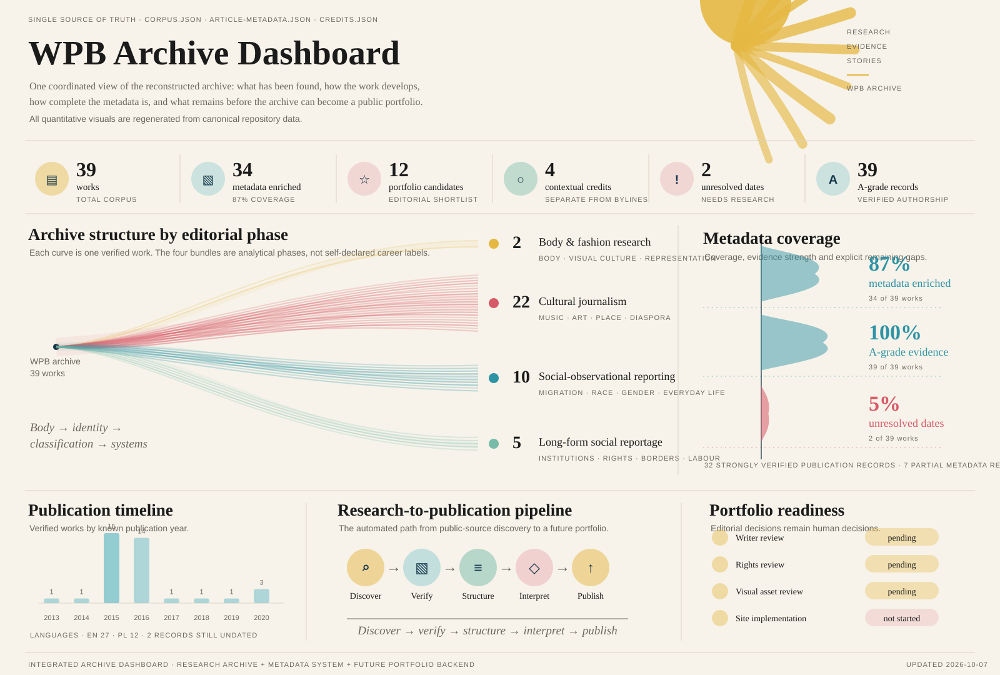

# Start here, Weronika

This repository is a working archive of your published work.

It was created to bring together material that is currently scattered across different publications, countries, languages and older web archives — and to turn that material into something you can actually use.

At the moment, it functions mainly as a **research archive and reconstructed bibliography**.

Later, if you want, the same repository can also become the content base for a **portfolio website**.

---

## Reading the dashboard

The dashboard at the top is designed as the quickest way to understand the project. It combines everything that was previously shown in separate charts:

- **38 verified works** and the current metadata/portfolio status
- the four analytical phases in the writing, with **one line per verified work**
- the real publication timeline from the recovered corpus
- metadata completeness and unresolved gaps
- the research path from discovery to publication
- the decisions still required before a public portfolio is ready

It is not a manually maintained poster. It is generated from the same structured data that powers the archive, so when reviewed data changes the dashboard changes with it.

For more explanation, open **[DASHBOARD.md](DASHBOARD.md)**.

The repository also contains a **repeatable metadata-harvesting system**. It can search public sources, old author pages, archive captures and scholarly indexes for missing work and publication details. It records evidence for review rather than automatically deciding that every name-match is your work.

You do not need to run or understand that system yourself.

---

## CareerHub — finding work

There is a separate **[CareerHub](CareerHub/CONTROL_ROOM.md)** for the practical job search.

You only need to think about three steps:

### 1 — Find jobs
Open CareerHub and look at the current shortlist. Jobs refresh automatically on weekdays. If you trigger a manual refresh, new results normally appear after about **30–90 seconds**.

### 2 — Choose job
When a job looks interesting, CareerHub asks: **Do you want to analyse this job?** Press **YES — Analyse this job**. CareerHub then saves it, ranks it, remembers the deadline and prepares the HRDM/application pack.

### 3 — Apply
Edit the Word draft, send the application and then follow the case through:

**Applied → Contacted → Portfolio/Test → Interview/Meeting 1–5 → Offer / Denied**

CareerHub also keeps a historic Job Vault, so jobs do not disappear just because a new sourcing run has replaced the shortlist.

For chosen jobs, deadline reminders can be sent in GitHub and optionally by email or SMS.

You do **not** need to understand GitHub Actions, HRDM, APIs, YAML or JSON to use it.

---

## What has been collected so far

The archive currently brings together verified work from different parts of your writing history, including:

- academic and research writing
- fashion and visual-culture work
- cultural journalism
- interviews
- music and arts writing
- social and observational reporting
- migration reporting
- long-form reportage
- work on gender, healthcare, labour, reproductive rights, borders and institutions

The material currently spans publications such as:

- *Fashion, Style & Popular Culture*
- *Kultura Współczesna*
- *The Forumist*
- *Krull Magazine*
- *Totally Stockholm*
- *VICE*
- *Gazeta Wyborcza / Duży Format*
- *Newsweek Polska*
- *Onet*

The archive is not presented as complete. Some older material may still be missing, especially where publications have changed websites, removed author pages, or never digitised print material.

---

## What you can do with this repository

### 1. Correct it

If anything is wrong — a date, title, outlet, role, interpretation or biography detail — it can be corrected.

Nothing here should be treated as more authoritative than your own knowledge of your work.

The repository deliberately separates:

- verified publication facts
- professional/contextual records
- unresolved leads
- analysis and interpretation

So corrections can be made without losing the history of how the archive was reconstructed.

---

### 2. Add missing work

You can add:

- articles that have not been found
- print-only work
- unpublished or commissioned pieces you still want represented
- talks, panels, interviews or public appearances
- radio, film or audio work
- translations
- editorial work
- teaching or academic work
- projects that sit outside conventional journalism

There is already a structured corpus in:

`data/corpus.json`

That file is the main source of truth for published work. A second file, `data/article-metadata.json`, stores deeper details such as publication timestamps, creative credits, DOI information and source evidence when those details are available.

You do not need to edit JSON yourself if you do not want to. The repository can be updated for you from a simple list, document, link collection or even notes.

---

### 3. Decide what should count as part of your public work

The archive is intentionally broader than a future portfolio.

A portfolio does not need to show everything.

You can decide:

- what you want to foreground
- what you want to leave in the archive only
- which texts best represent you now
- whether older fashion/culture work should remain visible
- whether you want journalism, academic work and translation shown together or separately
- whether you want the site to present you mainly as a journalist, writer, researcher, editor, cultural writer, or something else

There is already a provisional selection under:

`content/featured-work.md`

It is only a working suggestion.

---

### 4. Rewrite how you are described

Several working biography texts have been created from the published record.

They are stored in:

`content/profile.md`  
`content/bio-versions.md`

These are **not intended to define you**.

They are drafts built from the corpus.

You can rewrite them completely, keep only parts, or replace them with your own wording.

The same applies to the analytical description of recurring themes in your work.

---

### 5. Use the archive to see your own body of work differently

One purpose of the project is simply archival.

But another is to make patterns visible that are difficult to see when articles are spread across many years and publications.

The current analysis identifies recurring areas such as:

- body and representation
- identity and categorisation
- migration and belonging
- Poland and Sweden
- Cuba and transnational identity
- race and diaspora
- institutions and bureaucracy
- people whose lives do not fit neatly into established categories

The archive also suggests a broad development from:

**body / fashion / representation**

toward

**identity / migration / institutions / rights**

This is an interpretation of the corpus, not a claim about what you consciously intended.

You can challenge, reject, refine or expand any of it.

The longer analysis is in:

`analysis/writer-dossier.md`

---

## What could this become?

The repository has deliberately been structured so that it can later power a portfolio site without rebuilding everything from scratch.

A future site could contain, for example:

### Home
A concise introduction and selected work.

### Selected work
A smaller editorial selection of the pieces you most want people to read.

### Archive
A searchable/filterable list of your work by year, publication, language, subject or format.

### About
Your own professional biography.

### Themes
Optional thematic paths through the work — migration, identity, body, culture, Sweden/Poland, etc.

### Research / academic work
A separate area for your early academic and fashion-studies work.

### Other work
Translation, editorial work, film, talks, teaching or other professional work.

The current structure has been designed so those pages can be generated from the archive rather than maintained manually in two different places.

---

## What you do **not** need to do

You do not need to:

- understand GitHub
- edit code
- write JSON
- learn a website framework
- organise the archive yourself
- accept the current analysis
- keep everything that has been found

GitHub is simply being used as a transparent, versioned place to store the material.

You can treat the repository as a working folder with history.

---

## A useful way to review it

If you want to review the repository without going through every technical file, start here:

1. **`README.md`** — what the project is
2. **`content/profile.md`** — current working profile
3. **`content/featured-work.md`** — current proposed key works
4. **`bibliography/master-bibliography.md`** — reconstructed publication list
5. **`analysis/writer-dossier.md`** — deeper analysis of the work
6. **`sources/unresolved-records.md`** — things still uncertain or incomplete

That is enough to understand almost the entire project.

---

## The most useful things you can tell us

If you want to help improve the archive, the most useful information would be:

- what is missing
- what is wrong
- which pieces matter most to you
- which work you no longer identify with
- whether there are texts that should not be made prominent
- how you describe your own professional trajectory
- what you are doing now
- which languages you want a future portfolio to use
- whether you want the archive to remain research-oriented, become an official portfolio, or both
- whether you have original photographs, portraits, PDFs, scans or documents that can legally be used

Those answers would determine the next version.

---

## About ownership and rights

This repository does not claim ownership over your original work.

Copyright in published articles, photographs and other material remains with the relevant rights holders.

For that reason, the archive mostly stores:

- publication metadata
- links
- summaries
- research notes
- analysis

rather than reproducing full copyrighted articles.

If this becomes an official portfolio, we can separately decide what can be reproduced, excerpted or visually displayed.

---

## Current status

The repository is currently a **reconstructed working archive**.

It is not presented as a definitive biography, official bibliography or final portfolio.

The next stage depends on your input.

You can treat everything here as editable.

---

## In one sentence

**This is a structured reconstruction of your work that you can correct, expand, reshape and — if you want — turn into a public portfolio later.**
