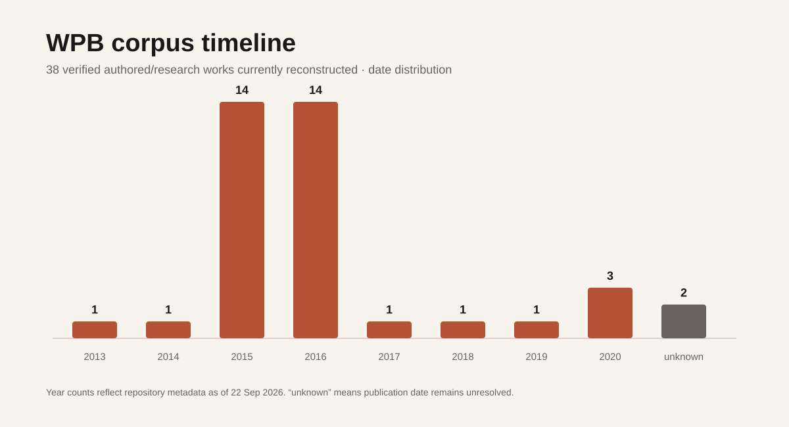
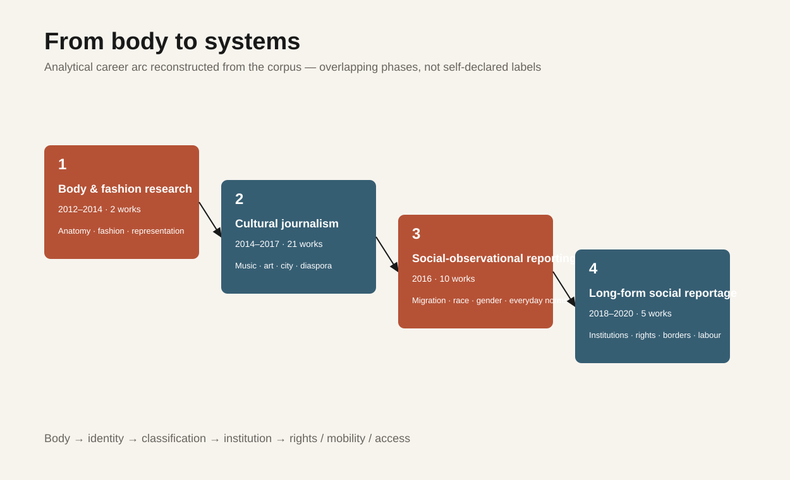
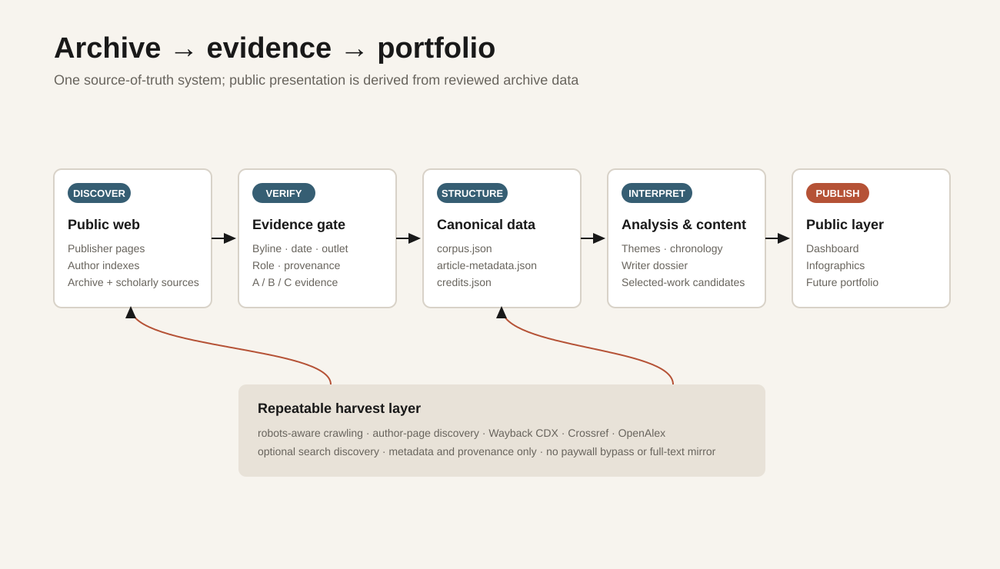
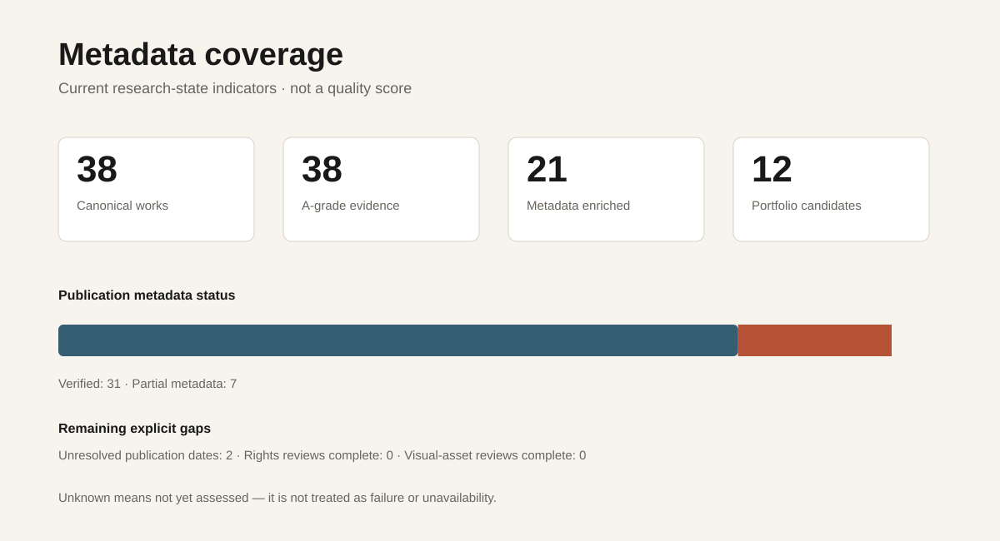

# WPB visuals

These are repository-generated, data-driven research visuals. They are **not yet the final portfolio visual identity**.

## Current infographics

### Corpus timeline

Shows the year distribution of the 38-work canonical corpus.

### Career arc

Shows the repository's analytical four-phase reading of the writing trajectory. The phases overlap and are not presented as the writer's own labels.

### Archive → portfolio

Shows how public-source discovery, evidence grading, canonical metadata, analysis and eventual public presentation relate.

### Metadata coverage

Shows current archive metadata state without turning incompleteness into a misleading quality score.

## Editable/source forms

- SVG files are plain-text vector graphics and can be edited directly.
- `research-pipeline.mmd` provides an editable Mermaid source for the archive/portfolio pipeline.
- `career-arc.mmd` provides an editable Mermaid source for the career arc.

Future portfolio artwork can replace these while preserving the same underlying data model.
